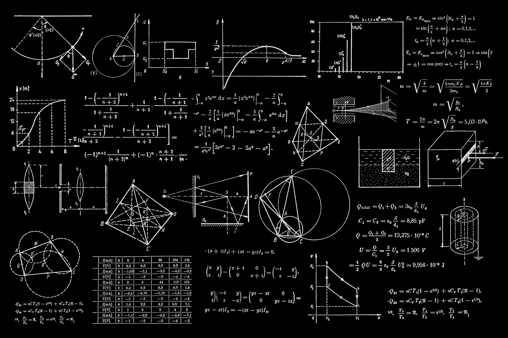

# 🎨 **NeuroPaint – AI Destekli Yaratıcı Tuval**

> **"Çizimin geleceğine hoş geldin. Sanatın sınırlarını yapay zeka ile yeniden çiz."**

NeuroPaint, klasik dijital boyama deneyimini yapay zeka (AI) gücüyle birleştiren, sadece bir araç değil, aynı zamanda sizinle birlikte düşünen bir **yaratıcı ortaktır**. Sıradan bir çizim programının ötesine geçen bu platform, fırça darbelerinizi analiz eder, niyetinizi anlar ve sanatınızı bir üst seviyeye taşımanız için anlık öneriler ve düzeltmeler sunar. Sanat ve teknolojinin bu eşsiz sentezi, sadece bir tuval sunmakla kalmaz, aynı zamanda kullanıcının zihnindeki imgeleri dijital gerçekliğe dönüştüren aktif bir katalizör görevi görür. Her bir pikselin, arka plandaki karmaşık sinir ağları tarafından işlendiği bu sistemde, sanatçının en ufak bir hareketi bile devasa bir veri okyanusunda anlamlandırılarak, estetik açıdan en mükemmel sonuca evrilir.

İster profesyonel bir illüstratör olun, ister hobi amaçlı çizim yapan bir sanatsever; NeuroPaint, hayal gücünüz ile dijital tuval arasındaki tüm engelleri ortadan kaldırmayı hedefler. Geleneksel yazılımların dayattığı teknik sınırlamalar, karmaşık menüler ve öğrenmesi aylar süren araç setleri yerine, NeuroPaint size akışkan, sezgisel ve sizi anlayan bir deneyim sunar. Bu platformda, teknik yeterlilik bir engel olmaktan çıkar; tek sınırınız kendi hayal gücünüz olur.

---

## 📚 **İçindekiler**

- [Vizyon](#vizyon)
- [Öne Çıkan Özellikler](#-öne-çıkan-özellikler)
- [Sistem Mimarisi](#-sistem-mimarisi)
- [Kurulum](#%EF%B8%8F-kurulum)
- [Kullanım Rehberi](#-kullanım-rehberi)
- [Teknoloji Yığını](#-teknoloji-yığını)
- [Yol Haritası (Roadmap)](#-road-map)
- [Katkıda Bulunma](#-katkı)
- [Lisans](#-lisans)

---

## 👁️ **Vizyon**

Yüzyıllardır sanatçılar, düşüncelerini fiziksel dünyaya aktarmak için fırça, kalem ve tuval gibi pasif araçlar kullandılar. Geleneksel dijital çizim araçları da bu pasifliği miras aldı; siz ne yaparsanız onu aynen yansıtırlar, hatanızı düzeltmez veya size ilham vermezler. **NeuroPaint** ise bu paradigmayı tamamen değiştirerek "Aktif Sanat Üretimi" çağını başlatıyor. Çizim sürecinize doğrudan dahil olur, kişisel stilinizi öğrenir, renk seçimlerinizden kompozisyon tercihlerinize kadar sizi analiz eder ve yaratıcı tıkanıklıkları aşmanızda size rehberlik eder.

Amacımız, sanatçının teknik detaylarla (perspektif kuralları, doğru gölgelendirme teknikleri, anatomik oranlar) boğuşarak zaman kaybetmesi yerine, enerjisini **saf yaratıcılığa** ve hikaye anlatımına odaklamasını sağlamaktır. Teknoloji, sanatın önüne geçmemeli, aksine sanatçının elini güçlendiren görünmez bir yardımcı olmalıdır. NeuroPaint, insan zekası ile yapay zekanın rekabet ettiği değil, işbirliği yaptığı "Augmented Creativity" (Artırılmış Yaratıcılık) prensibi üzerine, geleceğin sanat stüdyosu olarak tasarlanmıştır.

---

## 🌟 **Öne Çıkan Özellikler**

NeuroPaint'i sıradan çizim uygulamalarından ayıran ve onu benzersiz kılan devrim niteliğindeki yetenekler şunlardır:

### 🧠 **1. AI Stroke Prediction (Akıllı Çizgi Tahmini)**
Siz fırçayı tuvale değdirip hareket ettirdiğiniz anda, NeuroPaint milisaniyeler içinde bir sonraki hamlenizi tahmin eder. Eliniz titrediğinde oluşan bozuk çizgileri anında pürüzsüzleştirir, yapmak istediğiniz kavisleri mükemmelleştirir ve hatta yarım bıraktığınız bir şekli "Bunu mu çizmek istemiştin?" diyerek sizin yerinize tamamlar. Bu özellik, özellikle tablet kullanırken yaşanan hassasiyet kayıplarını minimize eder.
* **Nasıl Çalışır?**: Arka planda çalışan, kullanıcının geçmiş çizim verileriyle eğitilmiş hafif siklet bir LSTM (Long Short-Term Memory) modeli, imlecin hızını, basıncını ve yönünü (vektörel momentum) sürekli izler. Olasılık hesaplamaları yaparak en muhtemel rotayı çizer ve kullanıcıya sunar.

### 🎨 **2. Real-Time Style Transfer (Gerçek Zamanlı Stil Transferi)**
Çiziminizi yaparken tek bir tuşla tüm atmosferi ve sanat akımını değiştirebilirsiniz. Basit bir karakalem eskizi, saniyeler içinde Van Gogh'un fırça darbeleriyle bezenmiş bir şahesere veya fütüristik bir Cyberpunk sahnesine dönüşebilir. Bu özellik, konsept sanatçılarının farklı atmosferleri hızla denemesi ve fikir aşamasından final görünüme çok daha hızlı ulaşması için geliştirilmiştir.
* **Desteklenen Stiller**:
    * **Van Gogh**: Kalın, belirgin ve izlenimci fırça darbeleriyle rüya gibi sahneler.
    * **Cyberpunk**: Neon ışıklar, yüksek kontrastlı gölgeler ve distopik, karanlık bir atmosfer.
    * **Pixar 3D**: Yumuşak gölgelendirmeler, canlı renk paletleri ve sevimli, yuvarlak hatlı formlar.
    * **Mimari Eskiz**: Temiz, teknik, cetvelle çizilmiş gibi düzgün çizgiler ve blueprint estetiği.

### 🟦 **3. Shape Intelligence (Şekil Zekası)**
Elle çizilen daireler genellikle yamuk, kareler ise orantısız olur. NeuroPaint'in Şekil Zekası, çizdiğiniz formu anlık olarak analiz eder ve niyetinizi algılar. Kabataslak çizdiğiniz bir çemberi saniyeler içinde matematiksel olarak kusursuz bir daireye, bozuk bir dörtgeni ise tam bir kareye veya dikdörtgene dönüştürür. Bu özellik sadece temel geometrik şekiller için değil, karmaşık poligonlar ve oklar için de geçerlidir. UI/UX tasarımcıları için wireframe çizerken veya teknik çizim yapan mühendisler için vazgeçilmez bir hızlandırıcıdır.

### 🖼️ **4. Image → Editable Sketch (Görselden Çizime)**
Herhangi bir fotoğrafı veya referans görseli yükleyin ve NeuroPaint'in güçlü görüntü işleme motoru onu anında çizilebilir, düzenlenebilir vektörel katmanlara ayırsın. Bu özellik, pikselleri basitçe siyah-beyaz bir filtreye sokmakla kalmaz; görseldeki nesneleri tanır, konturlarını çıkarır ve bunları ayrı ayrı düzenleyebileceğiniz bir "eskiz" formatına çevirir. Bir manzara fotoğrafını yükleyip, ağaçların yerini değiştirebilir veya gökyüzünü silebilirsiniz.

### 🔍 **5. Infinite Canvas & AI Zoom (Sonsuz Tuval)**
Yaratıcılığınızı fiziksel bir kağıdın veya belirli bir piksel boyutunun sınırlarına hapsetmeyin. NeuroPaint'in sonsuz tuval teknolojisi sayesinde çalışma alanınız sınırsızdır. Tuvale yaklaştıkça (zoom-in), yapay zeka devreye girer ve o bölgedeki detayları "Super Resolution" teknikleriyle artırır, böylece pikselleşme sorunu yaşamazsınız. Uzaklaştıkça (zoom-out) ise projenizin devasa ölçeğini tek bir bakışta görebilir ve yönetebilirsiniz.

### 🗂️ **6. Smart Layer Naming (Akıllı Katman İsimlendirme)**
Dijital sanatçıların en büyük kabusu olan "Layer 1", "Layer 1 copy", "Layer 2" gibi anlamsız katman isimlerine son veriyoruz. NeuroPaint, üzerinde çalıştığınız katmandaki görsel içeriği gelişmiş görüntü tanıma algoritmalarıyla analiz eder. Eğer bir göz çizdiyseniz katmana otomatik olarak "Sol Göz", bir gün batımı boyadıysanız "Gün Batımı Gradyanı" ismini verir. Bu sayede yüzlerce katmanla çalışsanız bile projeniz her zaman organize ve düzenli kalır.

---

## 🏗️ **Sistem Mimarisi**

NeuroPaint, performans, ölçeklenebilirlik ve sürdürülebilirlik ilkeleri gözetilerek modern bir mikroservis mimarisi üzerine inşa edilmiştir. Her bir bileşen, kendi sorumluluk alanında en iyi performansı verecek teknolojilerle donatılmıştır.

### **Frontend (Arayüz Katmanı)**
* **React**: Dinamik ve reaktif kullanıcı arayüzü yönetimi için endüstri standardı olan React kütüphanesi tercih edilmiştir. Bileşen tabanlı yapısı sayesinde kodun yeniden kullanılabilirliği maksimize edilmiştir.
* **Konva.js**: Web tarayıcılarında Photoshop benzeri bir deneyim sunmak için yüksek performanslı 2D canvas render motoru olarak Konva.js kullanılmıştır. Binlerce nesneyi içeren karmaşık sahneleri bile 60 FPS akıcılığında işleyebilir.
* **Zustand**: Uygulama genelindeki durum (state) yönetimi için Redux'a göre çok daha hafif, hızlı ve boilerplate kodu az olan Zustand kütüphanesi seçilmiştir.
* **TailwindCSS**: Tasarım sürecini hızlandırmak ve tutarlı bir görsel dil oluşturmak için utility-first CSS framework'ü olan TailwindCSS kullanılmıştır.

### **Backend (Zeka Katmanı)**
* **FastAPI**: Python tabanlı, modern ve yüksek performanslı bir web framework'ü olan FastAPI, asenkron yapısı sayesinde aynı anda binlerce isteği (concurrency) çok düşük gecikme süreleriyle karşılar.
* **AI Engine**:
    * **OpenAI API (GPT-4o & Vision)**: Kullanıcının çizdiği şekilleri anlamlandırmak, metin tabanlı komutları işlemek ve akıllı katman isimlendirmesi yapmak için dünyanın en gelişmiş dil modellerinden faydalanılır.
    * **Stable Diffusion / Custom GANs**: Stil transferi ve sıfırdan görsel üretimi (text-to-image) işlemleri için özelleştirilmiş difüzyon modelleri ve GAN (Generative Adversarial Networks) mimarileri kullanılır.
* **WebSocket Manager**: Frontend ile Backend arasında HTTP isteklerinin yarattığı gecikmeyi ortadan kaldırmak için WebSocket protokolü kullanılır. Bu sayede < 50ms gibi inanılmaz düşük bir gecikme ile gerçek zamanlı veri akışı sağlanır.

### **Veri ve Depolama**
* **PostgreSQL + Prisma**: Kullanıcı profilleri, proje ayarları, çizim geçmişi ve diğer yapısal veriler, güvenilirliği ve performansı kanıtlanmış ilişkisel veritabanı PostgreSQL'de saklanır. Prisma ORM ile veritabanı işlemleri tip güvenli (type-safe) hale getirilir.
* **S3 / Supabase Storage**: Kullanıcıların oluşturduğu yüksek çözünürlüklü çizim dosyaları, referans görseller ve üretilen varlıklar, ölçeklenebilir bulut depolama çözümlerinde güvenle barındırılır.
* **Docker**: Geliştirme, test ve prodüksiyon ortamları arasındaki tutarsızlıkları önlemek için tüm servisler konteynerize edilmiştir. Docker Compose ile tek komutla tüm sistem ayağa kaldırılabilir.

---

## ⚙️ **Kurulum**

NeuroPaint projesini kendi yerel geliştirme ortamınızda (local environment) sorunsuz bir şekilde çalıştırmak ve geliştirmeye başlamak için aşağıdaki adımları sırasıyla ve dikkatlice uygulayın.

### Gereksinimler
Projeyi çalıştırmadan önce sisteminizde aşağıdaki araçların kurulu olduğundan emin olun:
* **Docker & Docker Compose**: Tüm servislerin izole bir şekilde çalışması için gereklidir. [Docker Desktop](https://www.docker.com/) uygulamasını indirip kurabilirsiniz.
* **Node.js**: Frontend geliştirmesi yapmak istiyorsanız gereklidir. (Sadece Docker ile çalıştıracaksanız zorunlu değildir).
* **Python 3.10+**: Backend geliştirmesi veya yapay zeka modelleri üzerinde çalışmak istiyorsanız gereklidir.

### Adım 1: Depoyu Klonlayın
Öncelikle GitHub üzerindeki kaynak kodlarını bilgisayarınıza indirmeniz gerekmektedir. Terminal veya Komut İstemi'ni açarak şu komutu girin:
```bash
git clone https://github.com/bahattinyunus/NeuroPaint.git
cd NeuroPaint
```

### Adım 2: Çevresel Değişkenleri Ayarlayın
Projenin çalışabilmesi için API anahtarları ve veritabanı bağlantı bilgileri gibi hassas verilere ihtiyacı vardır. Proje kök dizininde bulunan örnek `.env` dosyasını kopyalayarak asıl yapılandırma dosyasını oluşturun:
```bash
cp .env.example .env
```
Ardından favori metin düzenleyicinizle `.env` dosyasını açın ve özellikle `OPENAI_API_KEY` gibi kritik alanları kendi değerlerinizle doldurun.

### Adım 3: Docker ile Başlatın
Tüm sistemi (Frontend sunucusu, Backend API, Veritabanı) tek bir komutla ayağa kaldırmak için Docker Compose'un gücünden faydalanıyoruz. Aşağıdaki komutu çalıştırın:
```bash
docker compose up --build
```
*Not: Bu işlem, gerekli Docker imajlarının internetten indirilmesi ve yerel makinede derlenmesi nedeniyle ilk çalıştırmada internet hızınıza bağlı olarak birkaç dakika sürebilir. Lütfen sabırla bekleyin.*

### Adım 4: Erişim
Kurulum tamamlandığında ve terminalde "Server running" mesajlarını gördüğünüzde, tarayıcınızı açarak aşağıdaki adreslerden uygulamaya erişebilirsiniz:
* **Uygulama Arayüzü (Frontend):** [http://localhost:5173](http://localhost:5173) adresine giderek çizim yapmaya başlayabilirsiniz.
* **API Dokümantasyonu (Swagger UI):** [http://localhost:8000/docs](http://localhost:8000/docs) adresinden backend servislerini test edebilir ve endpoint'leri inceleyebilirsiniz.

---

## 🎮 **Kullanım Rehberi**

NeuroPaint'in arayüzü sezgisel olsa da, tam potansiyelini kullanabilmeniz için kısa bir rehber hazırladık:
1. **Araç Çubuğu**: Ekranın sol tarafında bulunan panelden temel çizim araçlarına erişebilirsiniz. Kalem ile serbest çizim yapabilir, Silgi ile hataları düzeltebilir veya Şekil araçları ile geometrik formlar oluşturabilirsiniz.
2. **AI Modunu Aktif Et**: Yapay zeka desteğini hissetmek için üst bardaki "AI Assist" butonuna tıklayın. Bu, *Stroke Prediction* (Çizgi Tahmini) özelliğini aktif hale getirecek ve çizimlerinizi anlık olarak iyileştirecektir.
3. **Stil Seçimi**: Çiziminizin havasını değiştirmek istiyorsanız, sağ panelden "Style Transfer" sekmesini açın. Listeden "Cyberpunk", "Van Gogh" gibi bir stil seçin ve "Apply" butonuna basarak büyüyü izleyin.
4. **Katmanlar**: Profesyonel çalışmalar için katman (layer) kullanımı şarttır. Sağ alt köşedeki katman panelinden yeni katmanlar ekleyebilir, sırasını değiştirebilir veya görünürlüğünü kapatabilirsiniz. Siz çizdikçe katman isimlerinin akıllıca güncellendiğine dikkat edin.
5. **Dışa Aktar**: Eseriniz tamamlandığında, üst menüden `File > Export` seçeneğine gidin. Çalışmanızı yüksek kaliteli PNG, JPG veya vektörel SVG formatında bilgisayarınıza indirebilirsiniz.

---

## 🛠️ **Teknoloji Yığını**

NeuroPaint'in arkasındaki güç, her biri kendi alanında lider olan modern teknolojilerin bir araya gelmesiyle oluşur:

| Kategori | Teknoloji | Açıklama |
|----------|-----------|----------|
| **Frontend** | React, Vite | Işık hızında hot-reload (HMR) özelliği ve modüler komponent yapısı için tercih edildi. Kullanıcı deneyimini en üst düzeye çıkarır. |
| **Canvas** | Konva.js | HTML5 Canvas elementi üzerinde yüksek performanslı grafik işlemleri yapmak için kullanılan kütüphane. Layer yönetimi ve event handling konusunda uzmandır. |
| **Styling** | TailwindCSS | Karmaşık CSS dosyalarıyla uğraşmadan, HTML içinde hızlıca stil tanımlamayı sağlayan modern framework. |
| **Backend** | FastAPI | Python ekosisteminin en hızlı web framework'lerinden biri. Pydantic ile veri doğrulama ve otomatik dokümantasyon (OpenAPI) sunar. |
| **AI/ML** | PyTorch, OpenAI | Derin öğrenme modellerinin eğitimi için PyTorch, genel zeka ve NLP görevleri için OpenAI GPT-4o kullanılıyor. |
| **Database** | PostgreSQL | Güçlü, açık kaynaklı ve güvenilir ilişkisel veritabanı. Karmaşık sorguları ve büyük veri setlerini rahatlıkla yönetir. |
| **DevOps** | Docker | "Benim makinemde çalışıyordu" sorununu ortadan kaldıran, uygulamanın her ortamda aynı şekilde çalışmasını sağlayan konteyner teknolojisi. |

---

## 🗺️ **Roadmap (Yol Haritası)**

NeuroPaint, sürekli gelişen ve yaşayan bir projedir. Gelecek vizyonumuzda yer alan heyecan verici özellikler şunlardır:

- [ ] **v1.1 - Multiplayer Mode (Çok Oyunculu Mod)**: Google Docs mantığıyla, aynı tuval üzerinde arkadaşlarınızla veya ekip arkadaşlarınızla eş zamanlı olarak, dünyanın farklı yerlerinden çizim yapabilme imkanı.
- [ ] **v1.2 - Voice Command (Sesli Komut)**: Ellerinizi klavyeden çekmeden, sadece sesinizle "Arka planı gece mavisine boya", "Sağ üst köşeye bir güneş ekle" gibi komutlarla tuvali yönetme yeteneği.
- [ ] **v1.3 - AI Brush Store (AI Fırça Mağazası)**: Topluluk tarafından eğitilmiş, belirli stilleri (örn. suluboya, yağlı boya, karakalem) taklit eden özel AI fırçalarının paylaşıldığı ve indirildiği bir pazar yeri.
- [ ] **v1.4 - 3D Entegrasyonu**: 2D olarak çizdiğiniz karakter veya nesneleri, tek bir tuşla basit 3D modellere dönüştürüp farklı açılardan inceleyebilme özelliği.
- [ ] **v2.0 - Mobil Uygulama**: Tablet (iPad/Android) ve akıllı telefonlar için dokunmatik ekranlara ve kalem (stylus) kullanımına özel olarak optimize edilmiş native mobil uygulamalar.

---

## 🤝 **Katkıda Bulunma**

NeuroPaint, açık kaynak felsefesine yürekten inanan bir projedir. Geliştirici, tasarımcı veya sadece fikir sahibi biri olmanız fark etmeksizin katkılarınızı memnuniyetle karşılıyoruz.
1. Bu depoyu GitHub üzerinde sağ üstteki "Fork" butonuna basarak kendi hesabınıza kopyalayın.
2. Bilgisayarınıza indirin ve geliştirmek istediğiniz özellik için yeni bir dal (branch) oluşturun (`git checkout -b ozellik/yeni-ozellik`).
3. Kodunuzu yazın, testlerinizi yapın ve değişikliklerinizi açıklayıcı bir mesajla "Commit"leyin (`git commit -m 'Yeni özellik: Fırça hassasiyeti eklendi'`).
4. Dalınızı kendi deponuza "Push"layın (`git push origin ozellik/yeni-ozellik`).
5. GitHub üzerinden ana depoya bir **Pull Request (PR)** açın ve yaptığınız değişiklikleri detaylıca anlatın.

Lütfen büyük mimari değişiklikler yapmadan önce bir "Issue" açarak toplulukla tartışın; böylece enerjinizi en doğru yere kanalize edebilirsiniz.

---

## 📜 **Lisans**

Bu proje, açık kaynak dünyasının en özgürlükçü lisanslarından biri olan [MIT Lisansı](LICENSE) ile lisanslanmıştır. Bu, projeyi ticari veya kişisel amaçlarla özgürce kullanabileceğiniz, üzerinde değişiklik yapabileceğiniz ve dağıtabileceğiniz anlamına gelir. Tek şartımız, orijinal yazarlara atıfta bulunmanızdır.

---

<p align="center">
  <sub>❤️ ile <strong>NeuroPaint Team</strong> tarafından tasarlanmış ve geliştirilmiştir. Sanat için, gelecek için.</sub>
</p>
